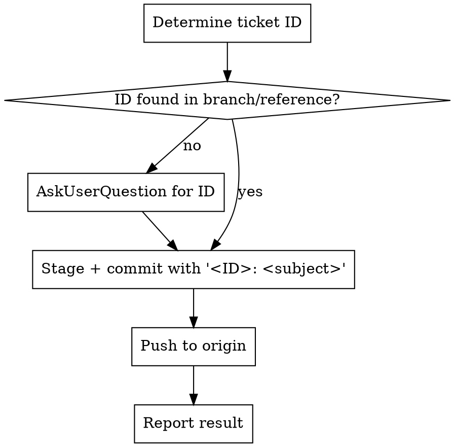

# Commit With Ticket

## Overview
Every commit carries a **ticket ID** in its subject and is **pushed to `origin`** in the same action. Extract the ID from the branch name (or another reference); if none is found, **ask the user before committing**. Never commit without a ticket ID. Never leave a finished commit unpushed.

## When to Use
- About to run `git commit` / `git commit -m` for finished work.
- User says "commit", "commit and push", "ship it", "land this", "create a commit".

**Not for:** an explicit "commit locally, don't push" / WIP the user wants kept local — honor that override (skip the push) but still attach a ticket ID unless the user says otherwise.

## Flow


## 1. Determine the ticket ID (try in order)
1. **Branch name** — `git branch --show-current`, take the first `[A-Z]{2,}-[0-9]+` match. Examples: `pr/ENG-985124-ruleEngineConfigChanges` → `ENG-985124`; `feature/NPLAN-7123-gen3-rule-engine` → `NPLAN-7123`.
2. **Other references** — latest `git log -1` subject on the branch, PR title, `$JIRA_TICKET`/`$TICKET` env var, or the task/PR-description doc in the worktree.
3. **Still none** — call `AskUserQuestion`: *"What ticket ID should this commit reference?"* Do **not** commit until the user answers. Accept an explicit "no ticket" only if the user says so verbatim.

## 2. Commit
Message format (matches repo convention `ENG-XXXXXX: <subject>`):
```
<ID>: <imperative subject>
```
- Subject ≤72 chars, imperative, no trailing period, no AI attribution.
- Body only when the "why" is non-obvious.
- Use heredoc for multi-line: `git commit -F-` or `git commit -m "$(printf ...)"`.

**NEVER** run a bare `git commit -m "fix"` with no ticket ID. If amending, preserve the ID.

**Deterministic backstop:** a PreToolUse hook (`~/.claude/hooks/commit_ticket_check.py`, wired in `~/.claude/settings.json`) denies any `git commit` whose message (from `-m`/`-F`) lacks `[A-Z]+-[0-9]+`. If the user **explicitly** chooses "no ticket" (Scenario B answer), bypass the hook for that one commit with `NO_TICKET=1 git commit -m "..."`. Never set `NO_TICKET=1` unless the user asked for a no-ticket commit.

## 3. Push to origin
```bash
git push origin HEAD        # if upstream already set
git push -u origin HEAD     # first push / upstream not set
```
- Always push to the remote named `origin` (not a fork/upstream unless the user says so).
- Verify exit code 0. On rejection (non-fast-forward) → `git pull --rebase origin HEAD` then push again. On no-remote/other error → surface it, don't silently continue.

## 4. Report
One line: commit short SHA + subject, and `pushed to origin/<branch>` (or the error).

## Common Mistakes
| Mistake | Fix |
|---|---|
| "Trivial change, skip the ticket" | No. Always attach; ask the user if missing. |
| Push to a fork instead of `origin` | Always `origin` unless user overrides. |
| "I'll push later" | Push is part of the same action — do it now. |
| `--amend` drops the ticket ID | Re-add the ID prefix. |
| Ticket pulled from a different branch's context | Use the **current** branch's ID. |

## Red Flags — STOP
- "It's too small to need a ticket" → ask the user; don't assume.
- "I'll push in a bit" → push now.
- Commit subject has no `[A-Z]+-[0-9]+` prefix → stop, get the ID.
