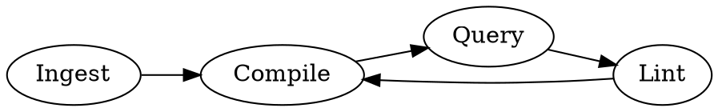

# LLM Knowledge Base

## Overview

Treat the LLM as a **compiler**: raw source documents go in, a structured, interlinked markdown wiki comes out. No vector DB needed at personal scale (~100 articles, ~400K words). Every session adds value back — the KB compounds.

## Four-Phase Cycle



### Phase 1 — Ingest
- Dump all source material into `raw/`: articles (Obsidian Web Clipper → `.md`), papers, repos, datasets, images
- Download images locally so LLM can reference them
- NEVER process raw files manually — LLM compiles them

### Phase 2 — Compile
LLM incrementally builds the wiki:
1. Auto-maintain `wiki/index.md` — one-line summary per article (entry point for all queries)
2. Write/update concept articles in `wiki/concepts/` with backlinks to related articles
3. Generate link graph → identify new article candidates
4. Derive outputs: slide decks (Marp), charts, rendered answers

### Phase 3 — Query & Enhance
- Ask complex questions against the wiki — LLM reads index first, then dives into relevant articles
- MUST file every query output back into the wiki (`wiki/outputs/` or enhance existing articles)
- Build a CLI search tool over wiki files; hand it to the LLM as a tool for larger queries

### Phase 4 — Lint
Run periodic health checks:
- Find inconsistent/contradictory data across articles
- Impute missing data via web search
- Identify cross-concept connections → new article candidates
- Merge near-duplicate articles, split oversized ones

## Directory Structure

```
knowledge-base/
  raw/              # Source docs — LLM reads, never edits
  wiki/
    index.md        # Auto-maintained: one-line summary per article
    concepts/       # Topic articles with backlinks
    outputs/        # Derived content filed back from queries
```

## Key Principles

| Principle | Rule |
|---|---|
| LLM owns the wiki | NEVER manually edit wiki files — LLM maintains them |
| Index-first navigation | LLM reads `index.md` to find relevant articles; loads only those |
| Outputs compound | Every query output MUST be filed back into the wiki |
| No RAG needed | Good index + context window suffices at personal scale |
| Incremental compilation | New raw docs merge into existing structure — no full reprocessing |

## Compile Prompt Template

```
Given the files in raw/ and the current wiki/, update the wiki:
1. Add/update index.md with a one-line summary for any new raw docs
2. Create or update concept articles for new topics found
3. Add backlinks between related articles
4. List new article candidates identified from link gaps
Do not modify files in raw/.
```

## Common Mistakes

| Mistake | Fix |
|---|---|
| Editing wiki files manually | Stop. Let LLM compile — manual edits get overwritten |
| Skipping index.md maintenance | Index is the only file LLM reads on every query — keep it current |
| Not filing outputs back | Outputs that don't re-enter the wiki are wasted context |
| Running full recompile on every session | Incremental only — compile only changed/new raw docs |
| Reaching for RAG too early | Try index + context first; add RAG only when wiki exceeds 500+ articles |
