# TestPilot

## Overview

Structured test-generation workflow. Given a complete implementation, TestPilot writes tests, builds a living spec, and auto-maintains both on every code change.

## When to Use

- Core logic is checked in and stable
- Need tests written from scratch
- Need an endpoint/response/error spec generated
- Returning to code after a change and tests need to stay current

## Workflow

```dot
digraph testpilot {
    rankdir=LR;
    "Code ready?" [shape=diamond];
    "Read implementation" [shape=box];
    "Generate tests" [shape=box];
    "Check coverage" [shape=diamond];
    "Write test spec → testing.md" [shape=box];
    "Run tests → verify green" [shape=box];
    "Anchor: use testing.md for all future changes" [shape=box];

    "Code ready?" -> "Read implementation" [label="yes"];
    "Read implementation" -> "Generate tests";
    "Generate tests" -> "Check coverage" ;
    "Check coverage" -> "Write test spec → testing.md" [label="acceptable"];
    "Check coverage" -> "Generate tests" [label="gaps found"];
    "Write test spec → testing.md" -> "Grill testing.md (/grill)";
    "Grill testing.md (/grill)" -> "Fix spec gaps" [label="FAIL/CONDITIONAL"];
    "Fix spec gaps" -> "Grill testing.md (/grill)";
    "Grill testing.md (/grill)" -> "Run tests → verify green" [label="PASS"];
    "Run tests → verify green" -> "Anchor: use testing.md for all future changes";
}
```



## Step-by-Step

### Phase 1 — Generate Tests

1. Read every file in the target module/service
2. Identify all public functions, endpoints, state transitions
3. Write unit + integration tests covering:
   - Happy path
   - Error/edge cases listed in `testing.md` (see Phase 2)
   - Boundary values
4. Aim for ≥80% line coverage; surface gaps explicitly

### Phase 2 — Write `testing.md` + Grill It

Create `<project-root>/testing.md` (or alongside the module). Required sections:

```markdown
# Test Spec — <Module Name>

## Endpoints / Entry Points
| Name | Input | Expected Output | Notes |
|------|-------|----------------|-------|

## Error Cases
| Scenario | Trigger | Expected Behavior |
|----------|---------|-------------------|

## Coverage Summary
| File | Lines | Covered | % |
|------|-------|---------|---|

## Run Commands
\`\`\`bash
# how to run all tests for this module
\`\`\`

## Last Updated
<date> — <what changed>
```

After writing `testing.md`, invoke `/grill` on it:
- **PASS** → proceed to Phase 3
- **CONDITIONAL/FAIL** → fix the identified gaps, re-grill until PASS

### Phase 3 — Anchor Loop (every future change)

On ANY code change to a covered file:
1. Open `testing.md` FIRST — understand current spec
2. Run relevant tests from the Run Commands section
3. If tests fail → fix implementation or tests (never delete tests to make them pass)
4. Update `testing.md`:
   - Add new endpoints/errors if introduced
   - Update coverage summary
   - Stamp "Last Updated"

## Rules

- NEVER skip `testing.md` creation — it is the anchor for all future work
- NEVER skip grilling `testing.md` — CONDITIONAL/FAIL blocks progression to Phase 3
- NEVER delete a test to make the suite green — fix the code or fix the assertion
- ALWAYS run tests before declaring a change done
- ALWAYS update `testing.md` same turn as code changes
- If `testing.md` already exists, READ it first before writing any test

## Quick Reference

| Task | Action |
|------|--------|
| First run | Phases 1 → 2 → grill → 3 in order |
| Code changed | Phase 3 anchor loop |
| New endpoint added | Add row to Endpoints table, write test |
| Test fails after change | Fix code, not the test |
| Coverage drops | Identify gap, add test, update summary |

## Common Mistakes

- Writing tests before reading `testing.md` → duplicate or conflicting tests
- Marking done before running tests → silent regressions
- Updating code without updating `testing.md` → spec drift, future confusion
